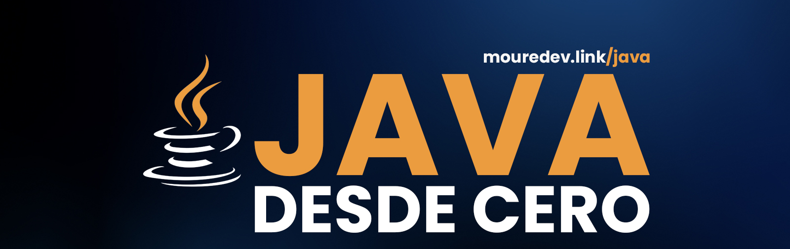

# Hello Java

## Curso para aprender el lenguaje de programación Java desde cero y para principiantes

### Proyecto realizado durante emisiones en directo desde [Twitch](https://twitch.tv/mouredev)
> ##### Si consideras útil el curso, apóyalo haciendo "★ Star" en el repositorio. ¡Gracias!

## 🆕 NUEVO: Curso desde cero [En desarrollo]

### 🔴 PRÓXIMA CLASE EN DIRECTO: Miércoles 30 de abril a las 20:00h (España) en [Twitch](https://twitch.tv/mouredev)
### 🗓️ CONSULTA EL HORARIO POR PAÍS Y CREA UN RECORDATORIO desde [Discord](https://discord.com/events/729672926432985098/1362554235664990578/1367198819942400000)

### Clases:

* Clase 1 [02/04/2025] - Introducción y Hola Mundo
	* [Vídeo](https://www.twitch.tv/videos/2422706574)
	* [Código](./basic/c00_helloworld/HelloWorld.java)

* Clase 2 [09/04/2025] - Comentarios, Variables, Constantes, Tipos de datos y Operadores
	* [Vídeo](https://www.twitch.tv/videos/2428998601)
	* [Ejercicios Hola Mundo](./basic/c00_helloworld/HelloWorldExercises.java)
	* [Variables y constantes](./basic/c01_beginner/VariablesAndConstants.java) | [Tipos de datos](./basic/c01_beginner/DataTypes.java) | [Ejercicios](./basic/c01_beginner/BeginnerExercises.java)
	* [Operadores](./basic/c02_operators/Operators.java) | [Ejercicios](./basic/c02_operators/OperatorsExercises.java)

* Clase 3 [17/04/2025] - Strings, Condicionales y Arrays
	* [Vídeo](https://www.twitch.tv/videos/2436086584)
	* [Strings](./basic/c03_strings/Strings.java) | [Ejercicios](./basic/c03_strings/StringsExercises.java)
	* [Condicionales](./basic/c04_conditionals/Conditionals.java) | [Ejercicios](./basic/c04_conditionals/ConditionalsExercises.java)
	* [Arrays](./basic/c05_structures/Arrays.java)

## Enlaces de interés

* Impacto: [Índice TIOBE](https://www.tiobe.com/tiobe-index/) | [GitHub](https://github.blog/news-insights/octoverse/octoverse-2024/) | [Stack Overflow](https://survey.stackoverflow.co/2024/technology#most-popular-technologies-language)
* [Historia](https://es.wikipedia.org/wiki/Java_(lenguaje_de_programaci%C3%B3n)) | [Kotlin](https://kotlinlang.org/)
* [Java 8](https://www.java.com/es/download/) | [Java SE](https://www.oracle.com/es/java/technologies/java-se-glance.html) | [Java EE](https://www.oracle.com/es/java/technologies/java-ee-glance.html)
* [OpenJDK](https://openjdk.org/) | [Oracle JDK](https://www.oracle.com/es/java/technologies/downloads/)
* Editores: [IntelliJ Community](https://www.jetbrains.com/idea/download/other.html) | [VS Code](https://code.visualstudio.com/docs/languages/java) | [NetBeans](https://netbeans.apache.org/front/main/index.html) | [Eclipse](https://eclipseide.org/) | [BlueJ](https://www.bluej.org/) | [Playground web](https://dev.java/playground/)
* [Documentación oficial](https://docs.oracle.com/en/java/)
* [Guía de estilo](https://google.github.io/styleguide/javaguide.html)

## Únete al campus de programación de la comunidad

#### Te presento [mouredev pro](https://mouredev.pro), mi proyecto más importante para ayudarte a estudiar programación y desarrollo de software de manera diferente.

> **¿Buscas un extra?** Aquí encontrarás cursos editados por lecciones individuales, para avanzar a tu ritmo y guardar el progreso. También dispondrás de ejercicios y correcciones, test para validar tus conocimientos, examen y certificado público de finalización, soporte, foro de estudiantes, reunionnes grupales, cursos exclusivos y mucho más.
> 
> Entra en **[mouredev.pro](https://mouredev.pro)** y utiliza el cupón **"PRO"** con un 10% de descuento en tu primera suscripción.

## Preguntas frecuentes

#### ¿Debo tener conocimientos previos?
Mi idea es que el curso sea desde cero y para principiantes. Pensado para una persona que comienza por primera vez a programar. Es un curso de fundamentos, donde nos centraremos en aprender las bases del lenguaje con Java puro. Esto no es un curso para aprender a desarrollar proyectos. Vamos a empezar desde el principio.

Si la acogida de la comunidad es buena, seguiré creando cursos más avanzados.

#### ¿Este curso se va a subir a YouTube?

Sí, una vez finalizados, todos los cursos son editados y subidos en bloque a YouTube.

#### ¿Existe algún lugar donde consultar dudas?
He creado un canal llamado "Java" en el [servidor de Discord](https://discord.gg/mouredev) de la comunidad. Allí puedes consultar dudas y ayudar al resto de miembros. Así nos beneficiamos tod@s.

#### ¿Cómo puedo practicar?
En cada lección encontrarás ejercicios para poner en práctica lo aprendido. También puedes realizar los ejercicios de mi web [retosdeprogramacion.com](https://retosdeprogramacion.com).

##  Hola, mi nombre es Brais Moure.
### Freelance fullstack iOS & Android engineer

Soy ingeniero de software desde 2010. Desde 2018 combino mi trabajo desarrollando Apps con la creación de contenido formativo sobre programación y tecnología en diferentes redes sociales como **[@mouredev](https://moure.dev)**.

Si quieres unirte a nuestra comunidad de desarrollo, aprender programación, mejorar tus habilidades y ayudar a la continuidad del proyecto, puedes encontrarnos en:

 
 
